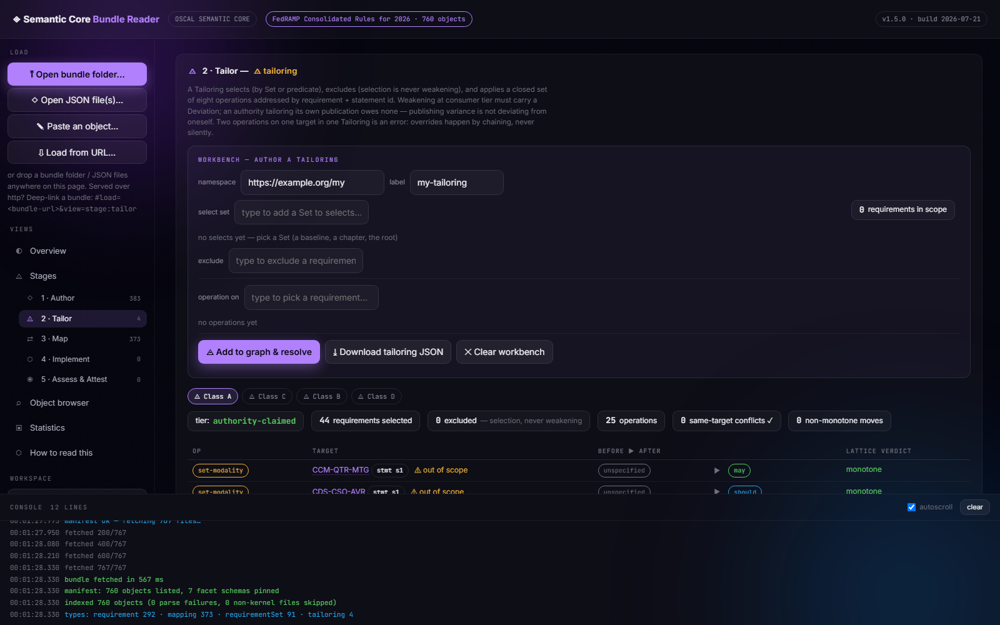
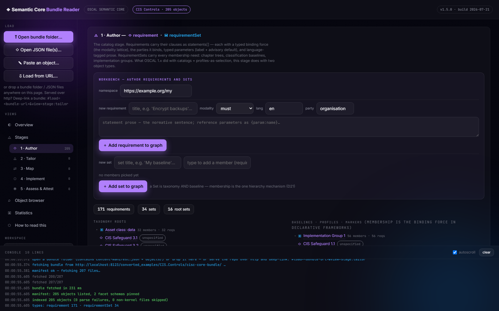
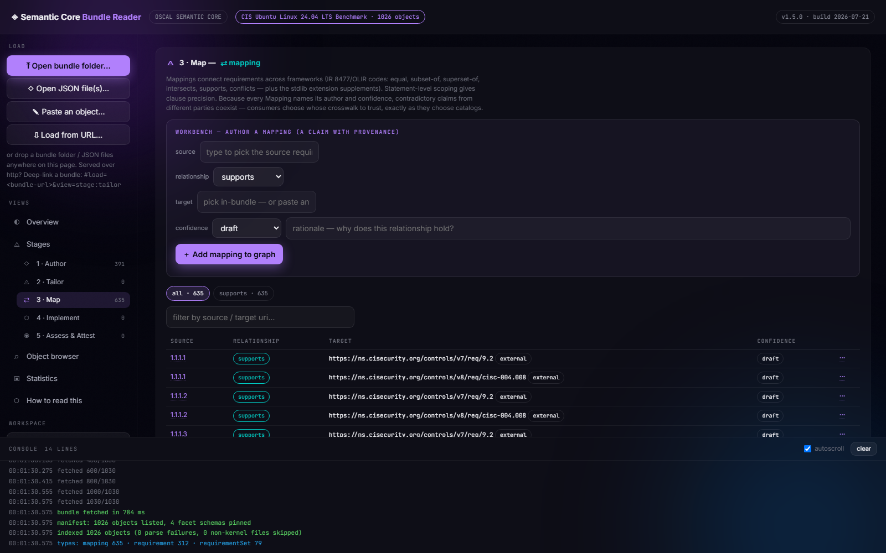

# OSCAL Semantic Core

**Machine-readable compliance, rebuilt around meaning: nine shallow object
types, two digests, and one house rule — every claim in the spec must survive
contact with real catalogs before it may stay.**

This repository is a working design study, not a slide deck. It contains a
draft specification with a public decision register, an **executable kernel
schema** with a **149-vector conformance corpus** and *two* reference
validators — Python, and a **zero-dependency PowerShell 5.1 twin that runs
on a stock Windows box** (the weekend-validator claim, measured: ~30×
smaller than the OSCAL 1.x toolchain, crypto engines included) —
**eleven framework and lifecycle corpora converted losslessly** (251,591
source leaf values, coverage computed rather than asserted — including NIST
SP 800-53 Rev 5, its 800-53B baselines, and CSF 2.0), a **bidirectional
OSCAL 1.2.2 export** that round-trips 5,647/5,647 objects to semantic-digest
equality against the official NIST schema, and a zero-dependency
**single-file reader & authoring studio** that turns the whole thing into
something you can click.

> Status: **pre-1.0, evidence-gated**, maintained in personal capacity.
> Nothing here is endorsed by NIST, BSI, ACSC, CCB, CIS, or FedRAMP.



*Above: the reader on the FedRAMP CR26 corpus. The `tier: authority-claimed`
chip is **derived from the data**, not asserted; every tailoring operation
gets a before→after lattice verdict; weakening without a recorded Deviation is
refused while you type.*

## Why this exists

OSCAL 1.x is *rigid where frameworks legitimately differ* and *contractless
where meaning actually lives* — and every measured pathology flows from one
side of that paradox:

- **Nobody used it.** FedRAMP's RFC-0024 (Jan 2026) records that of 100+ Rev5
  authorizations processed in 2025, **zero** submissions used OSCAL — the
  program the standard was co-designed with, in the year machine-readability
  became its central theme.
- **Valid and meaningless are compatible states.** The German Grundschutz++
  catalogs carry **12,059 namespace-qualified props** whose "schema" is a set
  of CSV files behind mutable links. Inside them sit **216 pseudo-placeholders**
  (`{{einem anerkannten Standard}}`) that imitate parameter syntax where it has
  no meaning — several contradicting the adjacent prose. Every OSCAL validator
  on earth certifies these documents as flawless.
- **The same model keeps getting rediscovered.** FedRAMP built CR26 on a green
  field in 2026 with no props mechanism, and its typed fields correspond almost
  one-to-one to the German prop names: `modal_verb` ↔ `force`,
  `target_object_categories` ↔ `affects`. Two teams, no coordination, one
  target model — convergent evidence about what the domain demands.
- **Membership gets hand-maintained twice.** 59 % of all ISM props are a
  5,301-entry applicability matrix duplicating information ACSC *also* ships as
  eight profile documents, because consuming the profile mechanism costs more
  than inlining.

Full argument with sources: [Chapter 1 — Why This Exists](semantic-oscal/references/ch01-why-this-exists.md).

## The bet

Nine kernel objects — Requirement, RequirementSet, Tailoring, Mapping,
Component, Implementation, Assessment, Finding, Attestation — plus two
sub-objects (Deviation, Authorization). Documents become renderings of the
graph rather than the unit of exchange.

Three layers, strictly separated:

| Layer | Holds | Contract |
|---|---|---|
| **Kernel** | What the census corpora were measured to need: binding force, clauses, typed parameters and deadlines, membership, aliases, history | Normative, fixed |
| **Facets** | Framework-specific vocabulary | Registered, schema-pinned, machine-checked; fail-closed on unknown semantics |
| **Annotations** | Rendering hints and chrome | Invisible to compliance |

Design rules that follow: failures are made *unrepresentable* rather than
forbidden (bound `{param:}` tokens, identity-addressed tailoring); integrity
uses two digests — package (bytes sent) and semantic (meaning approved) — so
signatures survive repackaging; and tools that don't understand something must
carry it or stop with a reason, never guess.

Every design decision is scored against four tests — *simpler · closer to
measured customer needs · no more props · less need for bespoke JSON* — in the
[Decision Rationale Register](drafts/oscal-semantic-core-decision-rationale-register.md)
(22 decisions plus a public amendment log; rejected alternatives stay on the
record).

Start here: [Chapter 2 — The Core in One Hour](semantic-oscal/references/ch02-the-core-in-one-hour.md),
or the [one-file explainer](semantic-core-explainer-concept-files-workflow.md)
if you prefer diagrams.

## Proof, not promises

The project moves through evidence gates; nothing advances on narrative.

- **Gate 1 — the census (done).** Three national corpora (ACSC ISM, BSI
  Grundschutz++, FedRAMP CR26) inventoried to the last prop *before* the
  architecture was drawn: the kernel is what all three were measured to need.
- **Gate 2 — executable (done).** The normative JSON Schema, seven stdlib
  facet descriptors (including a DSSE attestation envelope profile), a
  **149-vector conformance corpus** in twelve suites (canonicalization,
  modality lattice, parameters, tailoring law, attestation, facet
  enforcement, reference closure, lifecycle, authority tiers, DSSE
  verification, bundle composition, conditional-apply), and
  [`validate_core.py`](semantic-oscal/scripts/validate_core.py) — which
  re-verifies **6,675 objects across all eleven bundles with both SHA-256
  digests each**, every object matching exactly one kernel shape. Current
  totals: 4,583 Requirements · 1,066 Sets · 1,008 Mappings · 5 Tailorings ·
  and the five lifecycle types live at document scale (6 Components ·
  3 Implementations · 1 Assessment · 2 Findings · 1 Attestation).
- **Hardened by three external adversarial review rounds** (a FedRAMP
  automation-team exchange, a deep-research review, and twin
  independent red-team runs): findings land in the public backlog with
  counts, close via register entries, and corrections ship with
  strikethrough — including the ones that made us look worse. Measured
  size deltas versus the OSCAL sources: ISM **−29 %**, GS++ **−50 %**,
  CR26 **+55 %** — smaller where sources are redundant, larger where a
  bespoke format was terse. No round trips survive on marketing numbers.
- **Gate 3 — done (2026-07-22).** NIST SP 800-53 Rev 5.2.0 + all four
  800-53B baselines, CSF 2.0, and a full lifecycle corpus (SSP/AP/AR/POA&M →
  the five lifecycle types with digest verification). **Zero kernel-schema
  changes forced — the customer test passed.** All 373 pre-existing NIST
  mapping endpoints in the corpus now resolve against real objects; the
  FedRAMP CTL ODP overlay drained from a parked payload into a real
  `set-parameter` Tailoring addressed at declaring statements. The corpus
  also exposed and fixed two reference-validator defects (a tier-laundering
  wrapper-Set shortcut; multi-select list values) — exactly what
  evidence-gating is for.
- **Gate 4 — done (2026-07-22, same day).** The engines: **DSSE signature
  verification** (Ed25519, dependency-free — in verification mode an
  unsigned attestation can no longer prove authority), **bundle
  composition** (D3.5: highest-minor resolve, both payload sets
  re-validated, incompatibility reported never silently picked), and
  **conditional-apply** (one predicate, one primitive, one leash). Plus the
  two economic claims, measured: the **weekend validator**
  ([`validate_core.ps1`](semantic-oscal/scripts/validate_core.ps1) —
  PowerShell 5.1, zero installs, 149/149 vectors, ~30× smaller than
  compliance-trestle with crypto included) and the **bidirectional export**
  ([`export_oscal.py`](semantic-oscal/scripts/export_oscal.py) — 10/10
  catalog bundles schema-valid against the official NIST 1.2.2 schema,
  5,647/5,647 objects round-trip digest-equal). Numbers:
  [`drafts/gate-4-measurement.md`](drafts/gate-4-measurement.md).
- **Next.** The converter rerun (the `text` primitive delivery, `sharpens`→URI,
  real pinned facet schemas), OSCAL mapping/profile-model exports, and the
  standing invitation: a third-party clean-room validator build against the
  conformance corpus.

Reproduce the whole verdict in one line (needs [uv](https://docs.astral.sh/uv/)):

```
uv run --no-project --with jsonschema python semantic-oscal/scripts/validate_core.py
```

### The corpus

The census corpora (gate 1 — the evidence base the architecture was derived from):

| Corpus | Source | Emitted | Coverage |
|---|---|---|---|
| [AU.ISM](converted_examples/AU.ISM/ism-coverage-report.md) | ACSC ISM, OSCAL 1.1.2 catalog, 1,150 controls | 1,150 Requirements · 322 Sets | 36,161 / 36,161 leaf values |
| [geman.bsi](converted_examples/geman.bsi/bsi-coverage-report.md) | Grundschutz++ v2026-07-16, OSCAL 1.1.3 (MS-TLS dropped by decision — defects reported to BSI) | 651 Requirements carrying 999 statements · 221 params with label/default · 162 Sets | 49,431 / 49,431 |
| [FedRAMP-CR26](converted_examples/FedRAMP-CR26/cr26-coverage-report.md) | CR26 bespoke JSON, v2026.07.14.01 | 292 Requirements · 373 Mappings · 91 Sets · 4 Tailorings | 7,294 / 7,294 |

Validation corpora (converted 2026-07-21; the model held without kernel
changes beyond the same morning's already-decided D9-rev parameter
`label`/`default` — evidenced by the census corpus (BSI ×179), decided
before these conversions ran, and first exercised by DE.C3A):

| Corpus | Source | Emitted | Coverage |
|---|---|---|---|
| [BE.CyFun](converted_examples/BE.CyFun/cyfun-coverage-report.md) | CCB CyberFundamentals 2025, BASIC + ESSENTIAL resolved catalogs (one corpus) | 218 Requirements · 124 Sets (3 cumulative baselines) | 4,312 / 4,312 |
| [CIS.Controls](converted_examples/CIS.Controls/cisc-coverage-report.md) | CIS Controls v8.1, OSCAL 1.1.3 | 171 Requirements · 34 Sets (IG1–3 baselines, asset/function categories) | 5,493 / 5,493 |
| [CIS.Ubuntu2404](converted_examples/CIS.Ubuntu2404/cisb-coverage-report.md) | CIS Ubuntu 24.04 LTS Benchmark v1.0.0 | 312 Requirements · 635 Mappings (v7+v8) · 79 Sets (4 recovered profile baselines) | 20,698 / 20,698 |
| [DE.C5](converted_examples/DE.C5/c5-coverage-report.md) | BSI C5:2026, OSCAL 1.2.2 | 623 Requirements · 190 Sets (basic baseline + additional criteria) | 5,868 / 5,868 |
| [DE.C3A](converted_examples/DE.C3A/c3a-coverage-report.md) | BSI C3A v1.0, OSCAL 1.2.2 (GS++ grammar family) | 30 Requirements · 30 typed parameters (first `label`/`default` use) · 9 Sets | 1,093 / 1,093 |

Gate-3 corpora (converted 2026-07-22; census first —
[`drafts/gate-3-census.md`](drafts/gate-3-census.md) — zero kernel-schema
changes forced):

| Corpus | Source | Emitted | Coverage |
|---|---|---|---|
| [US.SP800-53](converted_examples/US.SP800-53/sp800-53-coverage-report.md) | NIST SP 800-53 Rev 5.2.0 catalog + four 800-53B baseline profiles, OSCAL 1.2.2 | 1,014 Requirements (1,600 statement-scoped ODP params, SP 800-53A layer as facet) · 25 Sets (20 families + 4 baselines + root); 182 withdrawn tombstones inverted onto successor `replaces[]` | 115,680 / 115,680 |
| [US.CSF](converted_examples/US.CSF/csf-coverage-report.md) | NIST CSF 2.0, OSCAL 1.2.2 | 106 Requirements · 29 Sets (functions → categories → subcategories, 3-level nesting); 91 withdrawn (12 categories + 79 subcategories) inverted | 4,726 / 4,726 |
| [US.IFA-GoodRead](converted_examples/US.IFA-GoodRead/ifa-coverage-report.md) | OSCAL IFA GoodRead example set (SSP + AP + AR + POA&M) + leveraged/leveraging SSP pair + component-definition | 6 Components · 3 Implementations (D5 `inherited-from` with basis-ref) · 1 Assessment · 2 Findings (one approved risk-adjustment Deviation) · 1 Attestation (the ATO) · 2 carried Requirements | 835 / 835 |

Each conversion ships a computed coverage report that declares every rule with
counts and **reports source defects rather than repairing them** — the BSI run
surfaces all 213 pseudo-placeholders in the current GS++ catalog for the
authors' queue (the census figure of 216 included MS-TLS's 3, dropped from the
corpus 2026-07-21); the C5 run surfaces a six-fold `gc-undefined` id collision.
Finding real defects in shipping national catalogs is what "the converter is a
measurement instrument" means.

## See it: the bundle reader

[`one-page-apps/semantic-core-reader.html`](one-page-apps/semantic-core-reader.html)
is the whole model in one HTML file — no build, no dependencies, nothing
leaves your browser. It reads any bundle from `converted_examples/` and makes
the five stages of the compliance graph *functional*, not diagrammatic:

<p>


</p>

- **Read** — objects rendered for humans: kernel fields plain, facets tinted
  (registered semantics), annotations dashed (chrome); modality lattice,
  typed parameters, language-tagged prose. The object browser filters by
  **every vocabulary dimension the loaded corpus carries** — kernel and
  facets alike, auto-populated; free text is excluded by measurement (values
  that never repeat), and the log names what was excluded and why.
- **Verify** — one click recomputes both SHA-256 digests of every object
  against the manifest, entirely client-side; attestations get the bi-modal
  verdict (Full Match / Semantic Match / Tamper).
- **Tailor** — build a Tailoring against the loaded corpus with the weakening
  law enforced live: easings demand a Deviation, unit-class crossings are
  blocked, same-target conflicts refused, and the authority tier is derived
  from the data. Resolve it to an exportable package (Appendix B in the
  browser).
- **Author everything** — Requirements with `{param:}` tokens auto-declared,
  Sets, Mappings with external targets, systems of assets with a
  filter-driven control selector (auto-populated from every kernel and facet
  dimension the corpus actually carries), checklist assessments that mint
  real Assessment and Finding objects.
- **Export a real bundle** — the workspace leaves as a ZIP with a
  content-manifest carrying both digests per object: re-loadable here,
  verifiable by `validate_core.py`. Authored objects persist across reloads.


*Above: the object browser on the Grundschutz++ corpus — fifteen filter
dimensions auto-populated from the data (threats, target-object categories,
tags, required documentation, protection goals, …). Every GS++ source prop
lives in a kernel field or a registered facet, so every one of them is
reachable here; the console below logs which fields were* not *offered as
filters and why (free text whose values never repeat).*

### Try it in 60 seconds

No server: download the HTML file, open it, drag any
`converted_examples/*/*-core-bundle` folder onto the page.

With a server (enables URL loading and shareable deep links):

```
git clone https://github.com/christoph-puppe/Semantic-OSCAL-2-Ideas.git
cd Semantic-OSCAL-2-Ideas
python -m http.server 8000
```

then open

```
http://localhost:8000/one-page-apps/semantic-core-reader.html#load=../converted_examples/FedRAMP-CR26/cr26-core-bundle/&view=stage:tailor
```

— the `#load=<bundle-url>&view=<view>` fragment auto-loads any bundle and
jumps to any view, so every screenshot in this README is a link you can
reproduce.

## Install as a Claude skill

[`semantic-oscal/`](semantic-oscal/) is an installable skill that guides an
agent through authoring, validating, and migrating Semantic Core content. Its
[SKILL.md](semantic-oscal/SKILL.md) turns the 15 handbook chapters into 14
numbered requirements, each with reference chapters and companion examples;
it carries the worked example bundle in [`examples/`](semantic-oscal/examples/)
(a self-consistent graph from a zero-facet minimum requirement through
attestations with semantic digests), the converters in
[`scripts/`](semantic-oscal/scripts/), the normative kernel schema, the seven
stdlib descriptors, and the conformance corpus.

Install by copying the directory into your skills folder, or unpack
`SKILL_semantic-oscal.zip`:

```
~/.claude/skills/semantic-oscal/     # user-level
.claude/skills/semantic-oscal/       # project-level
```

## Read the spec

- [`drafts/oscal-semantic-core-v0.5-specification.md`](drafts/oscal-semantic-core-v0.5-specification.md) — the normative draft
- [`drafts/oscal-semantic-core-decision-rationale-register.md`](drafts/oscal-semantic-core-decision-rationale-register.md) — every decision scored against the north star, with rejected alternatives and amendments
- [`drafts/oscal-semantic-core-v0.6-spec-feedback-backlog.md`](drafts/oscal-semantic-core-v0.6-spec-feedback-backlog.md) — the living input queue for v0.6: items enter with counts, leave via register entries
- [`oscal-models-overview-1x-vs-semantic-core.md`](oscal-models-overview-1x-vs-semantic-core.md) — the eight OSCAL 1.x document models mapped onto the nine objects, with reusable Mermaid sources

## House rules

Three rules govern the handbook, and you should hold it to them:

1. **Evidence tiers, always labeled** — every claim is *measured*,
   *designed-for*, or *hypothesized*. Corrections ship with the same
   prominence as the original claim.
2. **Concepts enter through the corpus** — no mechanism is introduced
   abstractly. If a concept can't be motivated by something an authority
   actually shipped, it isn't in the spec.
3. **Every "don't" names its corpse** — prohibitions cite the measured failure
   they prevent, with the number attached. A rule that can't name what it
   prevents is a rule to delete.

## Contributing

Objections are the point — [Appendix F](semantic-oscal/references/appendix-f-objections.md)
is an adversarial FAQ, and review findings land in the v0.6 backlog with their
diffs on the record. Items enter the backlog with counts and leave via a
decision recorded in the register; an item that can neither be evidenced nor
closed after two gate cycles gets deleted.
