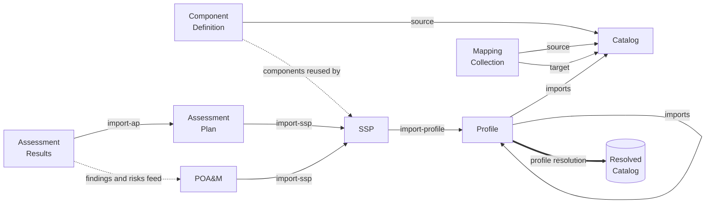
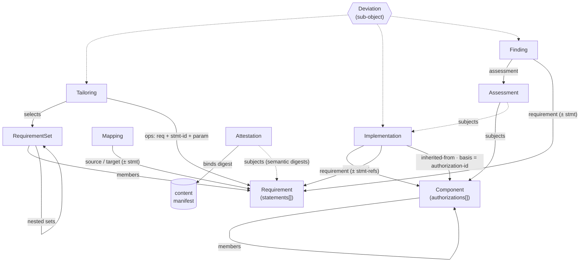
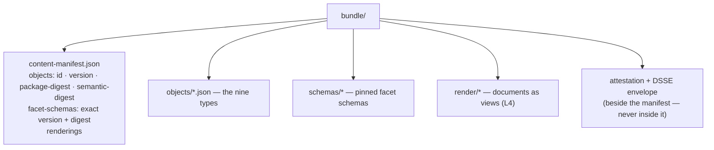
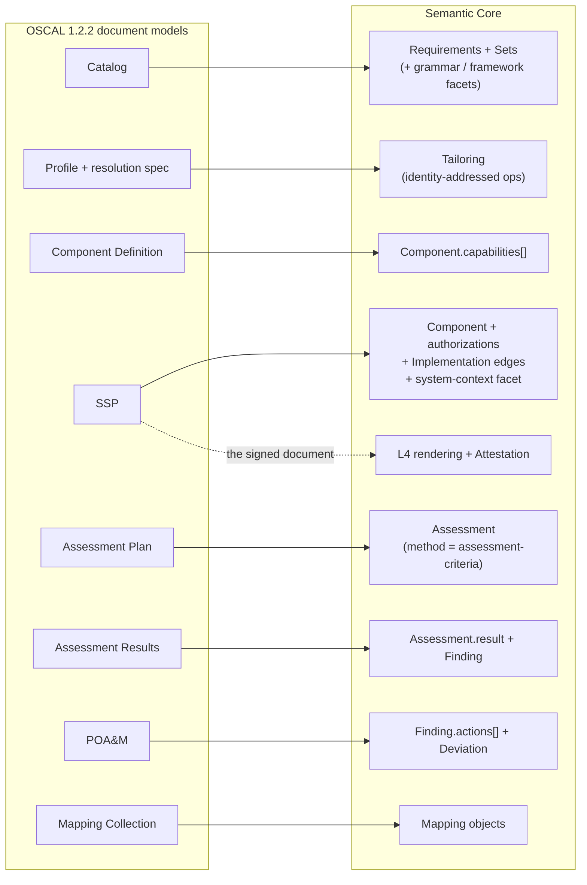

# OSCAL Artifact Landscape — an Overview
## 1.x document models · Semantic Core objects · how they relate
### Companion to Handbook Ch. 2 (translation table) and Ch. 11 (bundles) · 2026-07-18

Two worlds, two answers to "what files are there." In **OSCAL 1.x
(1.2.2)** the unit is the *document model* — eight fixed document
types that import each other. In the **Semantic Core** the unit is the
*object* — nine shallow types packaged in bundles; "documents" are
renderings. This overview shows both landscapes and the mapping
between them, with Mermaid sources you can reuse.

---

## 1. The old world: eight document models (OSCAL 1.2.2)

| Model | Purpose | Key imports / references |
|---|---|---|
| **Catalog** | Control library: groups, controls, parts, parameters | — |
| **Profile** | Selection + tailoring over catalogs; *profile resolution* produces a resolved catalog | `import` → Catalog(s) or other Profile(s) |
| **Component Definition** | Vendor/product claims: components + control-implementations against a source | `source` → Catalog/Profile |
| **SSP** (System Security Plan) | System characteristics + implemented requirements | `import-profile` → Profile; reuses CDef components |
| **AP** (Assessment Plan) | What will be assessed, how | `import-ssp` → SSP |
| **AR** (Assessment Results) | Observations, findings, risks | `import-ap` → AP |
| **POA&M** | Plan of Action & Milestones: tracked risks/findings | `import-ssp` → SSP; fed by AR findings |
| **Mapping Collection** (since v1.2.1, Mar 2026) | Relationships between two control sources | maps Catalog ↔ Catalog |

The load-bearing chain is Catalog → Profile → SSP → AP → AR → POA&M,
with Component Definitions feeding SSPs from the side and the Mapping
Collection spanning catalogs. Every hop is a whole document model with
its own deep tree — and the Profile hop additionally requires the
resolution specification (merge/keep/combine semantics) to mean
anything.

---

## 2. The new world: nine objects, two sub-objects, one bundle

| Object | Carries | Points at |
|---|---|---|
| **Requirement** | `statements[]` (id, modality, obligated-parties, parameters, prose) | parties, terms |
| **RequirementSet** | `members[]` (+`sequence`) | Requirements **or Sets** (nesting = taxonomy) |
| **Tailoring** | `selects`, `excludes`, ordered identity-addressed `operations[]` | Sets; Requirement + statement-id + parameter |
| **Mapping** | relationship (equal/subset-of/…), confidence, provenance | source/target Requirement (± statement scope) |
| **Component** | kind, `members[]`, `capabilities[]`, `authorizations[]` (identified, scoped) | other Components |
| **Implementation** | responsibility, status, parameter-bindings, evidence | Component × Requirement (± statement-refs); `inherited-from` + **basis → authorization-id** |
| **Assessment** | facet-typed method, performer, time, result | subjects: Components / Implementations |
| **Finding** | state, risk (facet), `actions[]` (due: date/duration) | Assessment; Requirement (± statement) |
| **Attestation** | signer, timestamp, rendering (pinned template) | content-manifest digest; subject **semantic** digests |
| *Deviation* (sub-object) | type, state machine, rationale, approver | attaches to Tailoring / Implementation / Finding |
| *authorizations* (sub-object) | authority-ref, scope (`includes[]`) | lives on Component; cited by basis-refs |

On every object: `facets{}` (registered, schema-pinned, declared
semantics) and `annotations{}` (chrome, compliance-invisible).

Reading aids: the **statement-id** is the shared fine-grained address
— tailoring operations, shared-responsibility implementation edges,
findings, and mapping scopes all use it. The **authorization-id** is
the boundary currency: inheritance edges must name the specific
context they lean on (edge-local, inductive — chains check link by
link). The **Deviation** is one channel at three moments: ex ante
(Tailoring), in operation (Implementation), ex post (Finding).

---

## 3. What a shipped "file" is now: the bundle

There are no fixed document files. A publication is a **bundle**:

Two rules make the anatomy: the manifest is the **local resolution
table** (sealed, zero-network validation resolves only through it),
and attestations sit **beside** the manifest by definition — nothing
signed contains its own signature (the hash-cycle rule). Verification
of an attested bundle is bi-modal: *Full Match* (exact package as
signed) or *Semantic Match* (compliance content proven, packaging
changed — e.g., annotations legitimately stripped).

---

## 4. Translation: where each 1.x model went

Notes that keep the picture honest:

- **Merge semantics have no target.** Profile `merge`/`combine`
  strategies do not exist in the Core — global identity removed the
  ambiguity they existed to arbitrate. Legacy profiles that *depended*
  on merge behavior are resolved in the old world first, then
  migrated (Handbook §14.2).
- **Parts split by kind.** Statement parts → `statements[]`;
  guidance/objectives prose → prose-only statements
  (`modality: "unspecified"`) or the Canonical Reference Facet
  (800-53's conventions, now a facet like everyone else's).
- **Props have three exits.** Registered facets (contracted),
  annotations (chrome) — or, for the measured majority (>70 % across
  three national corpora), **nothing**: membership, ordering, history,
  aliases, and clause structure were kernel deficits, now kernel
  mechanics (`Sets`, `sequence`, L0 versioning, `aliases[]`,
  `statements[]`).
- **The chain becomes a graph.** 1.x's Catalog→Profile→SSP→AP→AR→POA&M
  pipeline of documents becomes typed edges between nine object
  kinds; the *pipeline* survives as workflow, not as file formats —
  and the signed deliverable at the end survives as an L4 rendering
  bonded by an Attestation.

*Sources: OSCAL 1.2.2 model set (incl. the Mapping Collection added
with v1.2.1, March 2026); Semantic Core Specification v0.5 (D4, D13,
D20, Appendix A); Handbook Chapters 2, 9, 11, 14.*
