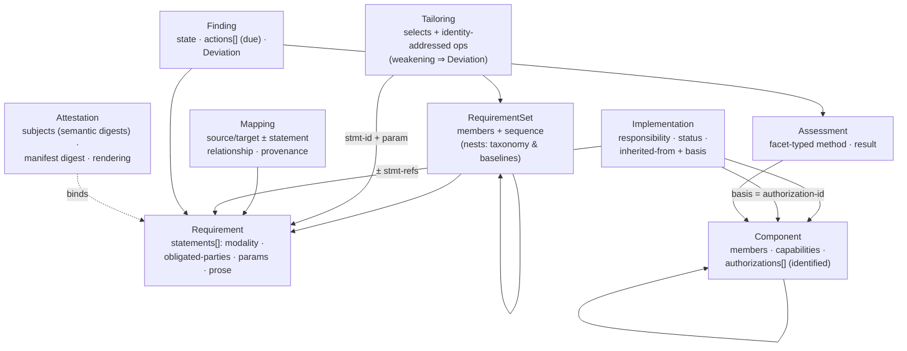
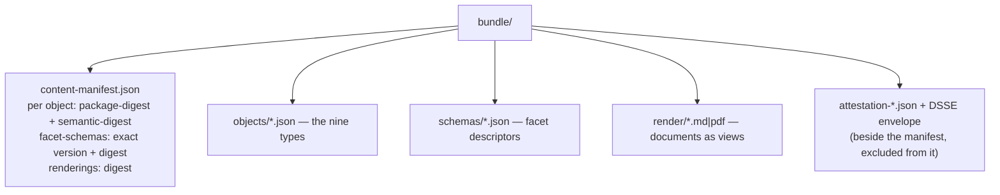
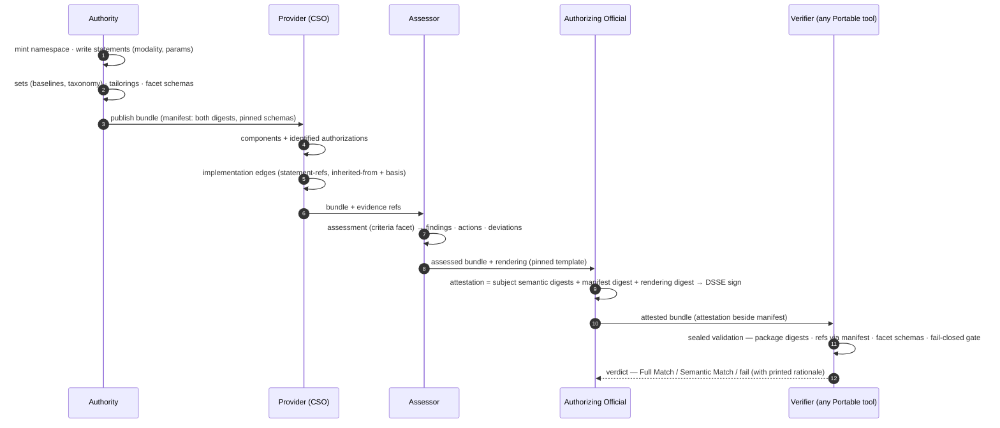
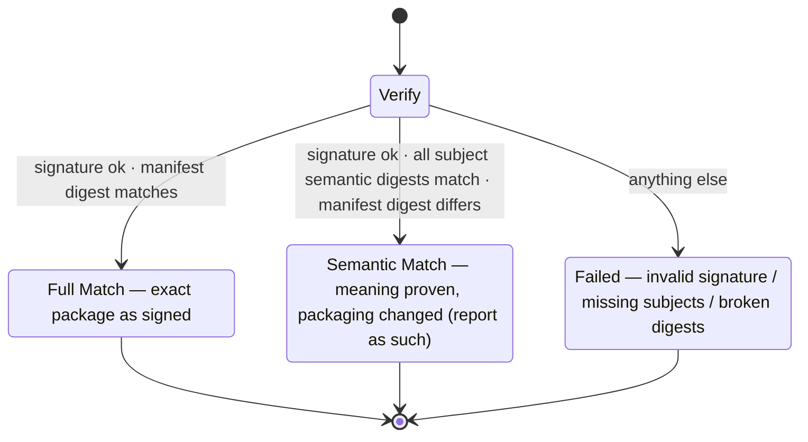

# JASCON — Concept · Files · Workflow
## The one-file explainer (with Mermaid)
### Companion to Spec v0.5, the Handbook, and `semantic-core-example-bundle/` · 2026-07-18

---

## 1. The concept, in five sentences

Compliance data becomes a **graph of nine shallow, globally identified
objects** — documents are just renderings of it. Everything three
national authorities were measured to need — binding force, clauses,
typed parameters and deadlines, membership, aliases, history,
deviations, crosswalks — lives **in the kernel**; everything
framework-specific lives in **registered facets** with machine-checked
schemas and declared semantics; rendering hints live in
**annotations**, invisible to compliance; and the measured majority of
yesterday's extensions (>70 % of counted props) simply **die**,
because they were imitating kernel mechanics. Failures are made
**unrepresentable rather than forbidden** (bound `{param:}` tokens,
identity-addressed tailoring, fail-closed on unknown semantics).
Integrity uses **two digests** — package (the bytes sent) and semantic
(the meaning approved) — so signatures survive legitimate repackaging
while tampering has nowhere to hide. Tools that don't understand
something must **carry it or stop with a reason — never guess**.

Reading keys: the **statement-id** is the shared fine address
(tailoring, shared responsibility, findings, mapping scope all use
it); the **authorization-id** is the boundary currency (every
inheritance edge names the context it leans on — checked link by
link); the **Deviation** is one audited channel at three moments
(tailoring · implementation · finding).

---

## 2. The files — what actually ships

A publication is a **bundle**: objects, pinned facet schemas,
renderings, one content manifest — and the attestation *beside* the
manifest (nothing signed contains its own signature).

Concretely, in `semantic-core-example-bundle/` (real computed
digests; closed references):

| Concept | Example file |
|---|---|
| Requirement — full / minimal / deadline | `objects/req-konf-14-1.json` · `req-ism-1234.json` · `req-iec-cso-iir.json` |
| RequirementSet — nested + multi-authority | `objects/set-crypto.json` · `set-baseline.json` |
| Tailoring — monotone ops, no Deviation needed | `objects/tailoring-elevated.json` |
| Mapping — third-party crosswalk | `objects/mapping-konf-ism.json` |
| Component — perimeter / consumer | `objects/component-paas.json` · `component-acme-saas.json` |
| Implementation — shared, inherited + basis | `objects/implementation-acme-konf.json` |
| Assessment / Finding (+Deviation) | `objects/assessment-2026q3.json` · `finding-017.json` |
| Attestation · Manifest · Facet schemas · Rendering | `attestation-acme-2026.json` · `content-manifest.json` · `schemas/*` · `render/authorization-summary.md` |

---

## 3. The workflow — end to end

Five roles, one bundle, no email archaeology:

Step-by-step in prose: the **Authority** authors requirements as
identified statements, expresses membership and variants as Sets and
Tailorings (never inline copies), publishes framework semantics as
schema-pinned facets, and ships a manifest with both digests. The
**Provider** models its stack as Components with identified
authorization contexts and states, clause by clause, how each
requirement is met — every inheritance edge naming its legal basis.
The **Assessor** runs criteria-driven Assessments; gaps become
Findings with computable deadlines; dispositions become typed
Deviations. The **AO** signs a rendering whose template is pinned —
the Attestation binds *meaning* (semantic digests), *package state*
(manifest digest), and *paper* (artifact digest) in one object. Any
**Verifier**, offline, replays the whole chain from the bundle alone
— and unknown semantics stop it with a reason instead of a guess.

The verification verdict is deliberately bi-modal:

Semantic Match is information, not injury: someone stripped chrome or
repackaged in transit — lawful, visible, and provably unable to have
touched normative content (templates may read annotations only as
chrome).

---

## 4. One paragraph of "why", for the skeptic

The old model spent its complexity budget on infrastructure — a
meta-language, eight deep document models, a resolution algebra —
and disclaimed meaning; the measured result was 22,000+ annotation
props across three national corpora, 216 invisible defects inside
schema-valid documents, and a flagship program routing around the
standard entirely. This architecture inverts the spend: boring
infrastructure (one serialization, shallow objects, a half-page
resolver), all sophistication in the semantic contract — and every
design decision above traces to something an authority actually
shipped. *When in doubt, count.*

*Sources: Specification v0.5 (D1–D21, Appendices A–B) · Handbook
Chs. 2–15 · example bundle as listed. Mermaid renders on GitHub /
mermaid.live.*
