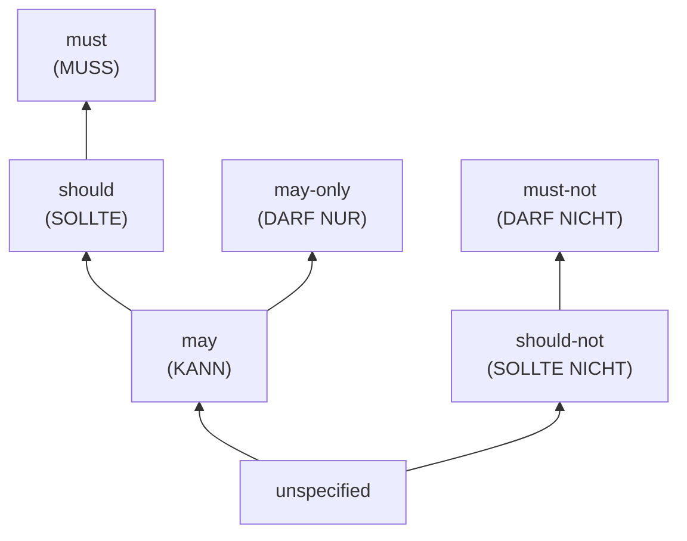

# The OSCAL Semantic Core Handbook
# Appendix C — Code Systems

**Purpose:** every enumerated vocabulary the kernel validates against —
each a **versioned closed set** (`codesystem@major`), checked by the
`code-from` primitive, changed only through the Chapter 15 process.
An unknown code is an error, never a warning, because the next tool
would have to guess — and the measured cost of unguarded value spaces
(`normal-SdT` beside bare `erhöht`; `Compliance Management` beside
`Compliance-Management`) is silent forking. Where the gate-item-1
converters produced real distributions, the observed numbers are
printed with the codes: a code system with usage data is governance
with eyes.

Section numbers below are the anchors Appendices A and B cite.

---

## C.1 Modality — the lattice

Seven codes on a **partial order**, two axes:

**Reading the lattice:** upward moves are monotone — free in any
Tailoring. Downward moves, and any move *across* branches (obligation
↔ prohibition, or between `may-only` and the should/must chain, which
are incomparable), require an attached Deviation
(`modality-monotonic`, B.1.6). `unspecified` sits below everything:
specifying is always tightening. `may-only` is the German
regulatory gem — *DARF NUR*: permitted **exclusively** under the
stated condition — which restricts rather than obliges, hence its own
branch above `may`.

**Observed (gate item 1):** three corpora, three signatures.
BSI GS++/MS-TLS is **should-heavy** (should 626 · may 225 · must 155 ·
unspecified 9 · **DARF NUR ×0** — anticipated by the lattice, unused
by the corpus). CR26 is **must-heavy** at rule level (must 136 ·
should 45 · may 20 · must-not 11 · should-not 5 · unspecified 29).
ISM is honestly **unspecified ×1,149** — declarative present-tense
prose, binding force via baseline membership. Three healthy
frameworks, three different force distributions: the lattice encodes
all of them without flattery.

## C.2 Lifecycle

`draft · active · deprecated · withdrawn` — on every object (A.0).
Deprecation is a state *with a successor pointer* (`replaces` on the
new object carries the mode); withdrawal is terminal. Identity events
(rebrand, split, merge, rename) are **not** lifecycle codes — they
are `canonical-alias`/`replaces` records (Chapter 3), because a state
field cannot carry a forwarding address.

## C.3 Workflow states

**Finding states (seed set):** `open · in-remediation · closed`.
Deliberately small — dispositions (false positive, accepted risk,
vendor dependency) are **Deviations**, not extra states, and deadlines
live in `actions[].due`. The corpse this smallness honors: the old
world encoded disposition workflow as four prop families, each
hand-carrying its own state machine through spreadsheets. Seed status:
gate item 2 confirms or extends with lifecycle-corpus evidence.

**C.3b Deviation states:** `investigating → pending →
approved | withdrawn` — one machine, four historical prop-copies
retired. Terminal states are terminal; re-litigation is a *new*
Deviation with its own record.

## C.4 Responsibility

`provider · customer · shared · inherited` — on Implementation edges.
`shared` composes with `statement-refs` for clause-level splits
(KONF.14.1: s1 provider, s2 customer); `inherited` requires
`satisfied-by.inherited-from` with its `basis-ref` (the D5 boundary
rule). Observed: the CR26 party universe (`affects[]`: Providers 159 ·
Agencies 24 · Assessors 23 · FedRAMP 16 · Advisors 3) maps onto
obligated-parties, with responsibility as the implementation-side
complement.

## C.5 Mapping relationships (IR 8477 / OLIR)

`equal · subset-of · superset-of · intersects · supports · conflicts`
— adopted, not invented: NIST IR 8477's harmonized set, so crosswalks
speak the vocabulary the mapping community already standardized.
Stewardship of the code system tracks upstream (the R13 standing
duty). The composition arithmetic (what survives a two-hop chain)
is Chapter 8's table; the short version: `equal` chains, everything
else degrades honestly toward `intersects`/`supports`.
**Observed:** 373 Mapping objects minted from CR26's untyped KSI
links — all `supports` per the §8.6 import rule, because flattering
an untyped link into `equal` is how crosswalk trust dies.

**`supplements`** *(v0.6 cycle, 2026-07-21)* — the one code beyond the
adopted IR 8477 set, clearly marked as a Semantic Core stdlib
extension: source attaches additional normative content to target,
the clause-precision edge of the supplement pattern (§6.A). It is not
a crosswalk claim: it does **not** chain in Chapter 8's composition
arithmetic (degrade as `supports`), and OLIR-facing exports MAY
down-translate it to `supports` losslessly for exactly that reason.

## C.6 Component kinds

`system · service · software · hardware · policy · process` — the
seed set covering the census's component universes (CSO stacks,
platform inheritance, organizational policies as components).
Interconnections are **relations between Components**, not a kind.

## C.7 Confidence

`draft · reviewed · authoritative` — on Mappings. The grade answers
"how much diligence stands behind this claim," and provenance answers
"whose diligence" — together they let contradictory mappings coexist
without a fistfight (D20). **Observed:** 373 × `draft` — correctly
humble for machine-imported link lists; `reviewed` appears in the
example bundle's hand-checked crosswalk; `authoritative` is reserved
for the mapping's *owner-of-record*.

## C.8 Relation types — the one extensible surface

Stdlib base codes: `related · required · uses-term · reference ·
schema`. Semantics that compute: removal of a `required`
edge in a Tailoring ⇒ Deviation (B.3); `uses-term` resolves into
terminology payloads; the rest are typed navigation.
**Removed (v0.6 cycle, backlog #20):** `supersedes` — D2 split that
conflated concept into `canonical-alias` (identity) and `replaces`
(lineage) after P7-B4 proved "supersedes = equivalence" unsafe; a
second, un-split lineage carrier on the relations channel would
resurrect exactly that hazard. No corpus used it (0 instances).
**Extension rule:** this is deliberately the *one* open-ish code
surface — authorities may mint additional, namespaced relation types
(URI-typed), which conformant tools **carry and display but do not
compute**. Rationale: link vocabularies are where legitimate
framework diversity is widest and computation stakes are lowest — the
opposite profile of modality, where one shared lattice is the whole
point. **Observed:** BSI `related` ×197 + `required` ×67; CR26
`related` ×23, `schema` ×24, `uses-term` ×222 (rules) + ×~42 (KSIs).

## C.9 Duration units and tightening

Two unit classes, one semantic boundary:
**elapsed-duration:** `seconds · minutes · hours` — clocks that run
through weekends (incident response).
**calendar-period:** `days · bizdays · weeks · months · years` — plus
a mandatory `calendar-ref`; computation fails closed without the
calendar (the representable-but-not-computable state is honest, not
broken).
The class boundary is load-bearing: "6 hours" and "1 bizday" are
different *semantics*, not different spellings — and the gate's refined count
found **zero true unit-class crossings** in CR26 (all 51 initially
flagged cases were variant-only rules with no base timeframe — a D13
ceremony question, not a D9 union question; the correction is itself
on the record). `tightening ∈ lower · higher · none` declares per parameter
which direction is stricter (deadlines: lower); bounds moves against
the declared direction ⇒ Deviation.

**Calendar contexts — `calendar-context@1` (stdlib code system, seed;
v0.6 cycle, backlog #13).** `calendar-ref` values SHOULD cite a stdlib
calendar-context code rather than a minted URL, so two jurisdictions'
tools resolve one `bizdays` value identically. Seed set:
`us-federal` (US federal holidays, Mon–Fri week), `de-bund` (German
federal holidays, Bundesland-neutral), `eu-target2` (TARGET2 banking
calendar). Each code pins holiday list + working-week + cutoff
semantics; the fail-closed rule is unchanged (no resolvable context ⇒
explained error, never a guess). The CR26 converter's ad-hoc
`…/cr26/calendar/us-federal` migrates to the `us-federal` code at the
next converter run (16 objects). Seed status: additions ship the Ch.15
way — an EU reporting corpus (NIS2/DORA) is the first expected extender.

## C.10 Small sets

**Implementation status:** `planned · partial · implemented ·
not-applicable`. **Assessment results (seed):** `satisfied ·
not-satisfied · inconclusive` — with the same C.3 smallness rule:
nuance belongs in Findings and evidence, not in result-code
proliferation. Seed status, gate-item-3 lifecycle corpus confirms.

---

## C.11 Governance footer (applies to every system above)

Each system is versioned independently (`modality@1`, `deviation@1`…);
`code-from` validates against the *pinned* version; additions are
minor versions, removals or meaning changes are majors with
deprecation lifecycles; every proposed code arrives the Chapter 15
way — counts, corpus cases, two implementations. The seed-set
markings above (C.3, C.10) are this book's evidence-tier discipline
applied to its own vocabulary: where the corpus hasn't voted yet, the
set says so.
